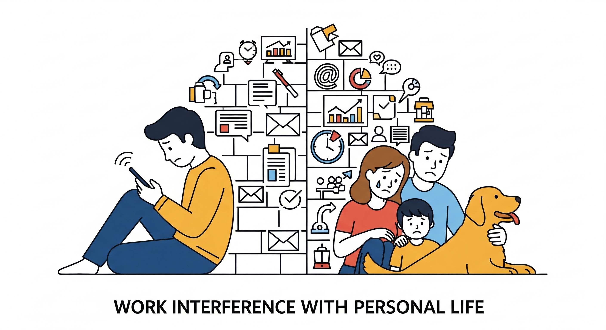
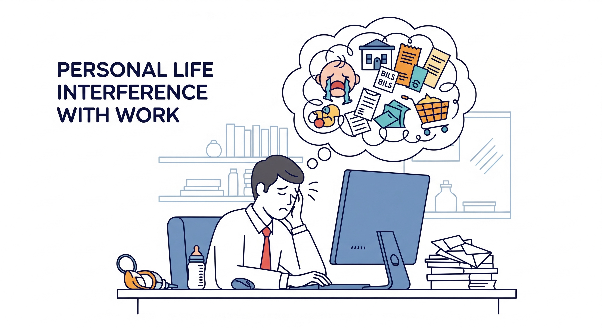
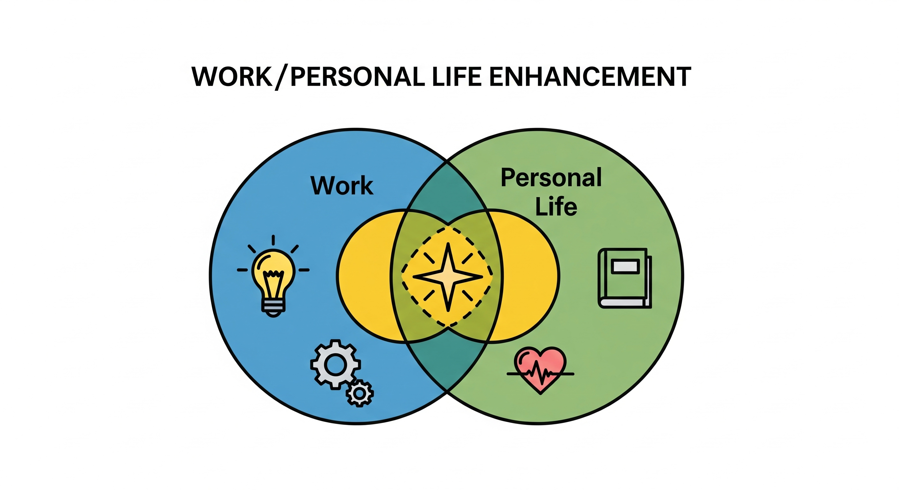
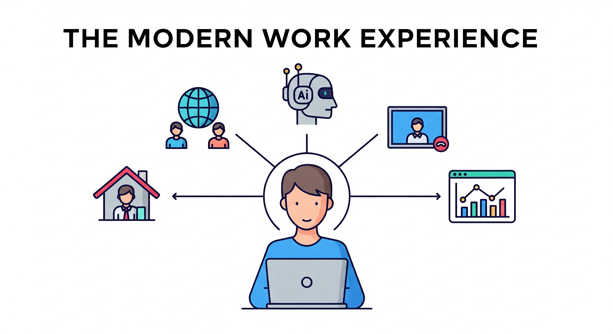

# Work-Life Balance & Modern Work Practices Survey

- @ https://pamudu123.github.io/modern-work-practices-survey/

A simple, black-and-white questionnaire about work–life balance and modern work practices.

Inspired by the Work–Life Balance Scale (J. Hayman, 2005) and refreshed for 2025, the survey includes:
- General background questions
- Work–Life Balance dimensions: WIPL, PLIW, WPLE
- The modern work experience (AI tools, collaboration, switching off)

Responses are anonymous. If you opt in to receive the final report, your email is used only to send it.

## Privacy
- Responses are stored for analysis in aggregate; individual responses are not published.
- Email is optional and requested only if you choose to receive the final report.
- Optional emails are stored separately from survey responses and are not used for marketing or shared with third parties.

## Preview

<table>
  <tr>
    <td></td>
    <td></td>
  </tr>
  <tr>
    <td></td>
    <td></td>
  </tr>
</table>

## For Teams & Organizations
Interested in running a similar survey for your team or organization? I am happy to analyze and share results with actionable recommendations. 
Let's connect: pamuduranasinghe9@gmail.com
